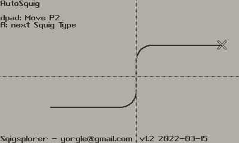
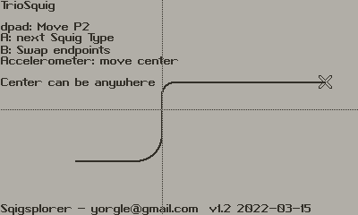
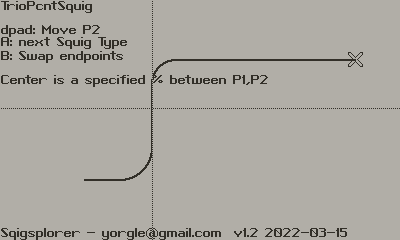

# Squigs!
A Playdate-ey spline line like thing but more squiggly and round-rect-ey.  It is made for the Playdate Lua SDK

-----

Squigs were created by me, Scott Lawrence (yorgle@gmail.com) and are provided here with an MIT license.  

Basically you only need share a link back to here if you use them in your commercial or non-commercial project.  I welcome any 
additions or improvements... feel free to send them back to me so I can add them in for others to use!

----- 
### Overview

I needed a spline like thing on Playdate for my Llogicr 
application, so I created a kind of roundrect equivalent which I call a "squig".

In this repo is a demo app that lets you interact with the different variations;

- Point 1 (start) is fixed in the lower left of the view
- Point 2 (end) is moved with the dpad
- Point 3 (control) is either automatically placed or moved with the accelerometer.  This point is indicated with the crosshairs.

In general P1 is leftmost point, and P2 isthe rightmost point.

A squig is called "horizontal" if the lines coming from P1
and P2 are horizontal, with the center connection line being vertical.

A squig is called "vertical" if the lines coming from P1 and P2 are vertical, with the center connection line being horizontal.

You will find the source code module in 
SquigDemos/Source/squigs.lua

Enjoy!

-----

### AutoSquig

    Squig.drawAutoSquig( x1, y1,  x2, y2 )

- x1,y1 is point 1 (P1)
- x2,y2 is point 2 (P2)
- Control point is placed at the midpoint between P1 and P2
- Always horizontal.  It cannot be inverted.

-----

### TrioSquig

    Squig.drawTrioSquig( x1, y1, xC, yC, x2, y2 )

- x1,y1 is point 1 (P1)
- x2,y2 is point 2 (P2)
- xC,yC is the control point
- Control point can be anywhere, but if it's outside of the space between P1 and P2, weird things might happen
- It is a horizontal squig if P1 is the leftmost squig, and it is a vertical squig if P2 is the leftmost squig

-----

### TrioPcntSquig

	Squig.drawTrioPercentSquig( x1, y1, xP, yP, x2, y2 )

- x1,y1 is point 1 (P1)
- x2,y2 is point 2 (P2)
- xP,yP is the control point location (value of 0.00 to 1.00 )

- Control point specified as a percentage from P1 to P2
 - 0.00, 0.00 would be exactly on P1
 - 0.25, 0.66 would be 1/4 the way horizontally to P2, and 2/3 of the way vertically to P2
 - 0.5, 0,5 would be exactly halfway between P1 and P2
- It is a horizontal squig if P1 is the leftmost squig, and it is a vertical squig if P2 is the leftmost squig
